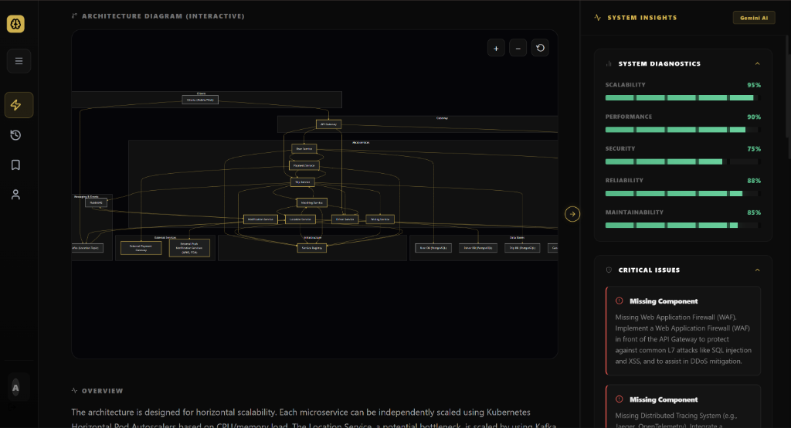
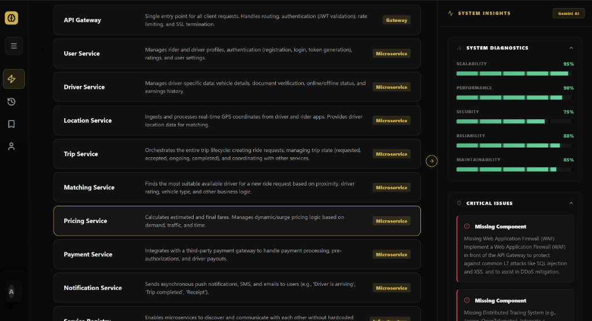
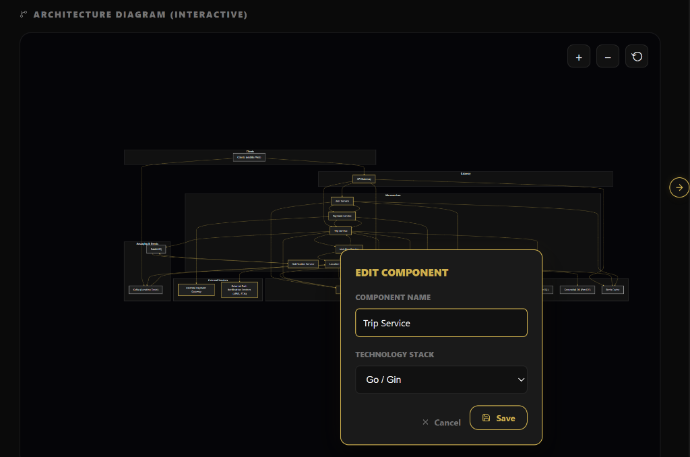
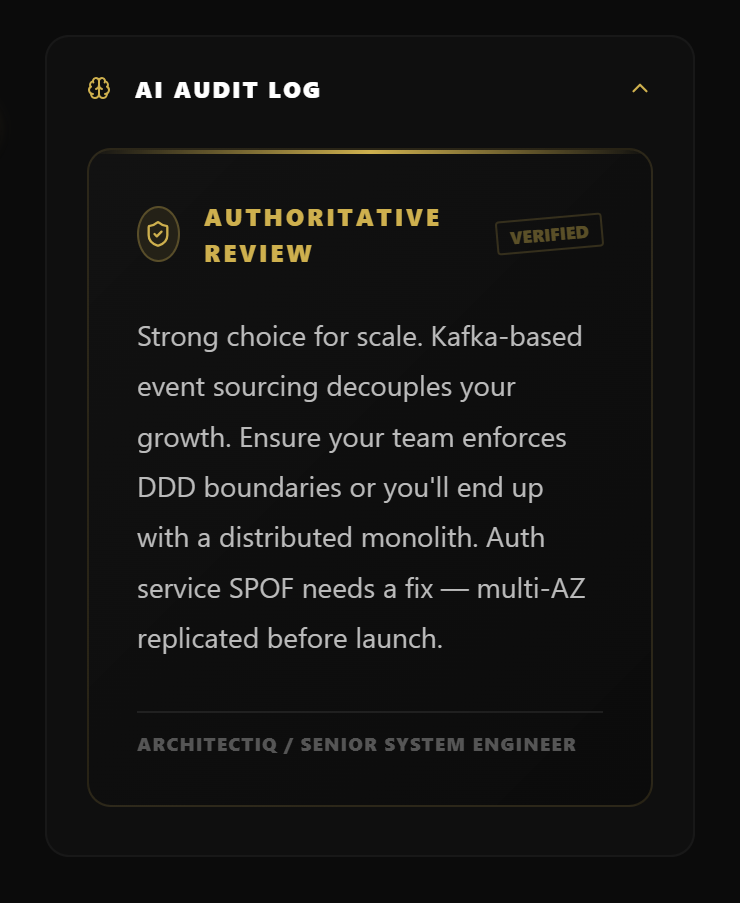
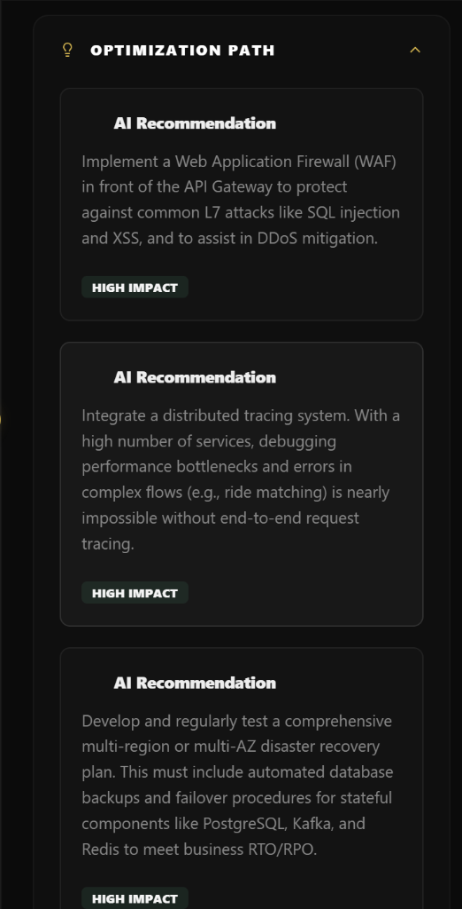
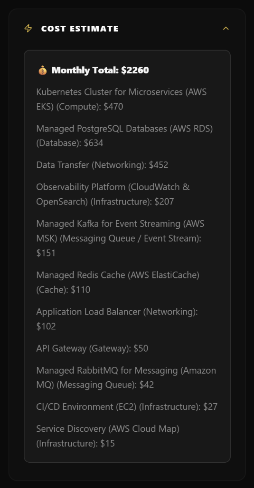

# ArchitectIQ

A professional platform for automated architectural design and distributed system validation.

---

## Overview

ArchitectIQ is an advanced Computer-Aided Design (CAD) platform engineered for software architecture. It leverages Large Language Models (LLMs) and Retrieval-Augmented Generation (RAG) to automate the generation, visualization, and stress-testing of complex distributed systems. By bridging the gap between computational requirements and technical implementations, ArchitectIQ minimizes architectural drift and identifies structural bottlenecks prior to deployment.



## Core Capabilities

* **Generative Blueprinting:** Transforms high-level functional requirements into multi-tier system diagrams using Mermaid.js syntax rendering.
  
  
  <br>
  

* **Automated Architectural Critique:** An adversarial AI agent evaluates architectures against standard anti-patterns, identifying single points of failure and latency bottlenecks.
  
  <div style="display: flex; gap: 10px;">
    
    
  </div>

* **Context-Aware Semantic Memory:** Utilizes vector indexing to maintain architectural consistency and cross-reference authoritative design patterns.
* **Constraint Validation Engine:** Real-time auditing of security protocols, data persistence strategies, and projected scaling costs.
  
  
* **Identity & Access Management:** Enterprise-grade authentication utilizing JSON Web Tokens (JWT) encrypted with Bcrypt.

---

## Technical Specifications

ArchitectIQ is built on modern, high-concurrency paradigms to ensure low-latency data processing.

### Frontend
Vite handles module dependencies natively, eliminating standard bundling overhead to provide sub-100ms Hot Module Replacement (HMR).
* **Framework:** React 19 and Vite
* **Styling:** TailwindCSS v4

### Backend
The backend utilizes asynchronous Python paired with non-blocking I/O layers to process logic generation efficiently.
* **API Architecture:** FastAPI
* **Data Persistence:** MongoDB (Motor)
* **Vector Engine:** Pinecone
* **Machine Learning:** Vertex AI (dense architectural embeddings, 768-D)

---

## Repository Structure

The component-based hierarchy is structured for strict module isolation:

```text
ArchitectIQ/
├── backend/
│   ├── app/
│   │   ├── api/            # Route handlers
│   │   ├── core/           # Authentication and configuration
│   │   ├── models/         # Pydantic and MongoDB schemas
│   │   ├── services/       # Vertex AI and Pinecone integrations
│   │   └── utils/          # Middleware and context utilities
│   ├── main.py             # FastAPI entry point
│   ├── requirements.txt    # Python dependencies
│   └── Dockerfile          # Backend containerization logic
├── frontend/
│   ├── src/
│   │   ├── components/     # Atomic UI units
│   │   ├── hooks/          # React hooks
│   │   ├── pages/          # View containers
│   │   ├── services/       # API integration layer
│   │   └── utils/          # Parsing algorithms
│   ├── package.json        # Node dependencies
│   └── vite.config.js      # Build configuration
└── docker-compose.yml      # Root orchestration layer
```

---

## Developer Experience & Deployment

The application is thoroughly containerized to ensure cross-environment consistency.

### 1. Environment Configuration

Create a `.env` file containing the necessary configuration constraints:

```env
MONGO_URI=mongodb+srv://<user>:<password>@cluster.mongodb.net/architectiq
GOOGLE_APPLICATION_CREDENTIALS=<path_to_gcp_credentials>
GCP_PROJECT_ID=<your_gcp_project_id>
PINECONE_API_KEY=<your_pinecone_api_key>
PINECONE_INDEX=architectiq
JWT_SECRET=<your_encrypted_jwt_secret>
```

### 2. Orchestration via Docker

Deploy the stack locally using Docker Compose to eliminate runtime disparities:

```bash
docker-compose up -d --build
```

* **Frontend Application:** `http://localhost:5173/`
* **Backend API Server:** `http://localhost:8000/`

---

## Data Consistency & Validation

The architectural evaluator relies on high-fidelity semantic similarity mapping. The integrated Pinecone Index must be configured as follows:

* **Dimension:** 768
* **Metric:** Cosine Similarity
* **Model:** textembedding-gecko (Vertex AI)

---

## Technical Roadmap

* [x] Initial Repository and Container Scaffolding
* [x] Integrate Vite and React 19 Frontend Framework
* [x] Integrate FastAPI and MongoDB Core Architecture
* [ ] **Terraform Export:** Translate system diagrams directly into actionable Infrastructure-as-Code.
* [ ] **Cost Projection API Integrations:** Connect with AWS/Azure Pricing APIs for infrastructure estimates.
* [ ] **Collaborative WebSockets:** Enable real-time, multi-user synchronous editing.

---

**ArchitectIQ** | Automated Systems Engineering Validation